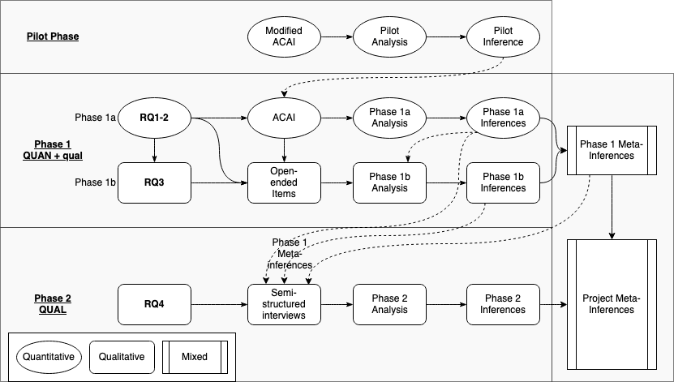

# Method

## Overview of the Problem, Purpose, and Questions{-}

Research suggests that higher education faculty receive little formal preparation for assessing learning [@lipnevichWhatGradesMean2020] and that there may be misalignment between modern pedagogical practices and the approaches to assessment taken by higher education instructors [@knightSummativeAssessmentHigher2002; @masseyAssessmentLiteracyCollege2020; @shepardRoleAssessmentLearning2000]. The purpose of this paper will be to outline a methodological approach to investigating higher education instructors' assessment literacies and practices as well as the impact of those practices on learners. Assessment literacy is the result of a complex interplay of skills, beliefs, and values about four domains of assessment practice: (1) the purposes of assessment; (2) the processes associated with designing, administering, scoring, and communicating the results of assessment tasks; (3) fairness in assessment practices; and (4) assessment theory, each with three priority areas. [@delucaDifferentialSituatedView2019].

Specific research questions to be addressed are:

1. Are there distinct patterns in higher education instructors' approaches to assessment in Canada?
2. Does the prevalence of these patterns differ by:
    - instructors' levels of experience in teaching face-to-face versus online?
    - instructors' levels of experience using technology?
3. What factors influence instructors' approaches to assessment?
4. How do instructors' assessment approaches affect learners' experiences?

In reviewing the extant literature concerning these topics and questions, and how researchers approach them, I searched the Educational Resource Information Center (ERIC), Google Scholar, and the University of Victoria Library Summon 2.0 databases. I also searched specific journals, such as Frontiers in Education, International Review of Research in Open and Distributed Learning, the Journal of Mixed Methods Research, Educational Measurement: Issues and Practice, and Assessment and Evaluation in Higher Education. Search terms included "assessment literacy", "assessment", "online", "higher education", "learning", and "learner impact" in various combinations. I also used [researchrabbit.ai](https://researchrabbit.ai) to assist with tracking citations of seminal and other important articles and for visualizing the relationships between found articles.

## Methodological Approaches{-}
All research is grounded in a particular tradition or worldview, often called a *paradigm*. A research paradigm is a set of philosophical assumptions and values about the universe and the ways in which we can learn and know about it [@johnsonEducationalResearchQuantitative2017]. According to Johnson and Christenson [-@johnsonEducationalResearchQuantitative2017], research paradigms are generally concerned with the answers to questions related to:
- how we learn about something (methodology),
- how we know something is true (epistemology)
- how we know reality, or if something exists (ontology),
- how we know if something is valuable or ethical (axiology), and;
- how we communicate and present arguments (rhetoric).

The three primary research paradigms are *quantitative*, *qualitative*, and *mixed* research (often called *mixed methods* research). Quantitative researchers traditionally followed the epistemological position of *positivism*, characterized by the idea that knowledge is singular, objective, and can be discovered through the empirical analysis of numerical data [@heldDecolonizingResearchParadigms2019], although most modern quantitative researchers take a *post-positivist* view which recognizes that the values and beliefs of the researcher play a role in research and challenge the idea of pure objectivity [@tashakkoriFoundationsMixedMethods2020]. Quantitative research is often confirmatory in nature, with the researcher gathering data to either confirm or disconfirm a specific hypothesis [@johnsonEducationalResearchQuantitative2017].  Qualitative researchers, on the other hand, tend to take the epistemological view of *constructivism* which posits that meaning is constructed by the researcher as they observe individuals and groups in relation to each other and particular phenomena. Qualitative research is exploratory in nature and uses non-numerical data such as texts, transcripts, images, and categories [@johnsonEducationalResearchQuantitative2017] in response to open-ended questions [@tashakkoriFoundationsMixedMethods2020]. During the latter half of the 20th century, when qualitative approaches were becoming more popular the research community tended towards a dualistic, 'either/or' view of these two paradigms [@niglasMultidimensionalModelResearch2010; @tashakkoriFoundationsMixedMethods2020] to the extent that the two paradigms were seen to be fundamentally incompatible. For example, Guba [-@gubaParadigmDialog1990, p. 81 as quoted in; @johnsonMixedMethodsResearch2004, p. 14] emphasized "accommodation between paradigms is impossible ... we are led to vastly diverse, disparate, and totally antithetical ends". Early in the 21st century, however, Johnson and Onwuegbuzie countered that argument and proposed that paradigms are better visualized on a continuum, that both paradigms are useful, and that mixing methods can "draw from the strengths and minimize the weaknesses of both in single research studies and across studies" [-@johnsonMixedMethodsResearch2004, p. 13-14]. So mixed research is characterized by an epistemologically *pragmatic* view that both quantitative and qualitative approaches are valuable and that combining numerical and non-numerical data, analyses, and results can lead to deeper understanding [@bazeleyIntegratingAnalysesMixed2018; @tashakkoriFoundationsMixedMethods2020]. More specifically, Johnson, et al. [-@johnsonDefinitionMixedMethods2007] provide the following definition of mixed research:

> Mixed methods research is the type of research in which a researcher or team of researchers combines elements of qualitative and quantitative research approaches (e.g., use of qualitative and quantitative viewpoints, data collection, analysis, inference techniques) for the broad purposes of breadth and depth of understanding and corroboration. (p. 123)

I will use the term *mixed research* in alignment with Johnson and Christensen [-@johnsonEducationalResearchQuantitative2017] who advocate for that term rather than *mixed methods research* because it is more than the method of research that is mixed. Indeed, mixing occurs at the level of paradigms, questions, methods, analyses, and reporting of results [@bazeleyIntegratingAnalysesMixed2018].

Niglas [-@niglasMultidimensionalModelResearch2010] contends that while the epistemological and philosophical stances of the researcher are important in informing the method of research, the more important considerations are the problem, purpose and questions the researcher intends to investigate. Similarly, Bazeley [-@bazeleyIntegratingAnalysesMixed2018] argues that the most important factor that researchers should consider when choosing a methodology is "whether the methods chosen and the strategies used ... serve the *purpose* of the research" (p. 8, emphasis in original). Following Bazeley's argument, and considering the purpose of this research project, a mixed approach is justified. Further justification is indicated in the diversity of approaches taken by researchers investigating assessment literacy or the impact of assessment on learners using quantitative [@delucaTeachersApproachesClassroom2016; @delucaExploringAssessmentCultures2021; @masseyAssessmentLiteracyCollege2020; @nayaginPreserviceTeachersApproaches2020; @pereiraHowUndergraduatesPerceive2021], qualitative [@boudWhatFeedbackLiterate2021; @coombsSeaSeaCanadian2020; @delucaPedagogySlowSignificant2021; @earleBalancingDemandsValidity2020; @fivesNavigatingComplexCognitive2020; @medlandAssessmentIlliterateShared2019; @watsonSmallDataOnline2017], and mixed [@delucaStudentPerspectivesAssessment2018; @nicholsonEnhancingStudentEngagement2018; @iannoneImpactHighStakes2020; @tekirAlignmentIntendedEnacted2021] approaches.

### Quantitative approaches{-}
The construct of assessment literacy has a history of being grounded in sets of standards published by researchers, governments, or regulatory agencies and of being assessed through the collection and analysis of numeric and categorical data [@delucaTeachersApproachesClassroom2016; @gotchSystematicReviewAssessment2014]. Gotch and French [-@gotchSystematicReviewAssessment2014], in their systematic review of the literature on assessment literacy inventories, found 36 instruments, all but one of which [@jarrEducationPractitionersInterpretation2012] gathered only quantitative (numeric and categorical) data. Studies based on these instruments (for example, Alkharusi, et al. [-@alkharusiEducationalAssessmentAttitudes2012] based on Plake, et al. [-@plakeAssessmentCompetenciesTeachers2005]) generally included quantitative analyses because the data gathered are quantitative. Early instruments [@mertlerMeasuringTeachersKnowledge2005; @plakeTeacherAssessmentLiteracy1993] were based on the 1990 *Standards for Teacher Competency in Educational Assessment of Students* [@StandardsTeacherCompetence1990]. Since then, Brookhart [-@brookhartEducationalAssessmentKnowledge2011] published a critique of the 1990 standards arguing that they were out of date and not in alignment with modern pedagogy. This was followed a few years later by Gotch and French [-@gotchSystematicReviewAssessment2014] publishing the aforementioned systematic review, during which they found that the psychometric properties of the 36 instruments published between 1991 and 2012 were low. Finally, Klinger et al. [-@klingerClassroomAssessmentStandards2015] published the *Classroom Assessment Standards for PreK-12 Teachers* [@klingerClassroomAssessmentStandards2015]. These cumulative advances led to DeLuca et al. [-@delucaTeacherAssessmentLiteracy2016] to develop the *Approaches to Classroom Assessment Inventory (ACAI)* and enabled researchers to base their quantitative investigations on an instrument shown to produce valid results in relation to a modern model of assessment literacy.

There are numerous examples of research teams using quantitative approaches to investigate assessment literacy, some of which are mentioned here. DeLuca et al. [-@delucaTeachersApproachesClassroom2016] surveyed 404 K-12 teachers in Canada and the USA using DeLuca et al.'s [-@delucaApproachesClassroomAssessment2016] *Approaches to Classroom Assessment Inventory (ACAI)*, an instrument based on the 2015 Standards. DeLuca et al. [-@delucaExploringAssessmentCultures2021], recently used the same inventory in an international study comparing assessment practices in the USA, Canada, and China. Nayagi and Rajendran [-@nayaginPreserviceTeachersApproaches2020] also used the ACAI to investigate approaches to assessment, although they modified it for their context of pre-service teachers in India. Massey et al. [-@masseyAssessmentLiteracyCollege2020] surveyed higher education instructors to investigate their approaches to and confidence with assessment. Lastly, with respect to the impact of instructors' assessment practices on learners, Pereira et al. [-@pereiraHowUndergraduatesPerceive2021], Pereira et al. [-@pereiraPerceptionsPortugueseUndergraduate2017], and Flores et al. [-@floresPerceptionsEffectivenessFairness2015] used surveys to collect quantitative data about the perceptions of Portuguese undergraduate learners regarding the assessment practices of their instructors. While there are more studies of assessment literacy in the K-12 sector [@medlandAssessmentIlliterateShared2019], there is a growing number in the higher education sector (e.g. [@masseyAssessmentLiteracyCollege2020; @nayaginPreserviceTeachersApproaches2020; @pereiraHowUndergraduatesPerceive2021]).

Research questions 1 and 2 in the present study are intended to answer questions about the assessment literacies of higher education instructors in Canada, a construct which has been shown to be amenable to quantitative survey approaches in diverse settings, including K-12 teachers, pre-service teachers, and higher education instructors both in Canada and internationally.

### Qualitative approaches{-}

Assessment literacy has been the focus of significant attention in quantitative research, but it is also becoming clear that the construct is much deeper and more complex than models based on sets of standards and competencies [@delucaPoliciesProgramsPractices2019; @delucaPoliciesProgramsPractices2019; @willisConceptualisingTeachersAssessment2013; @xuTeacherAssessmentLiteracy2016]. Willis [-@willisConceptualisingTeachersAssessment2013] framed assessment literacy within multiple "horizontal and vertical structures of educational discourse" following Bernstein [-@bernsteinVerticalHorizontalDiscourse1999], who described vertical discourses as structured disciplinary knowledge passed down from specialists, and horizontal discourses as more contextualized knowledge practiced and passed along at a local level. Following on this idea, DeLuca et al. [-@delucaDifferentialSituatedView2019] describe assessment literacy as being a "situated and differential practice predicated on negotiated knowledges" (p. 7) and elsewhere, DeLuca et al. [-@delucaPoliciesProgramsPractices2019] argue that "Assessment capability involves situated professional judgement, that is the ability to draw on learning and assessment theories and experiences to purposefully design, interpret, and use a range of assessment evidence in the service of student learning" (p. 2). Similarly, Xu and Brown's [-@xuTeacherAssessmentLiteracy2016] model, *Teacher Assessment Literacy in Practice (TALiP)*, explicitly includes socio-cultural factors, teacher judgement, and teacher identity.

The methodological implication of this shift to a more complex understanding of assessment literacy is that there seems to have been an attendant shift in researchers engaging in qualitative investigations of assessment literacy [@bearmanHowUniversityTeachers2017; @delucaPedagogySlowSignificant2021; @fivesNavigatingComplexCognitive2020; @medlandAssessmentIlliterateShared2019; @watsonSmallDataOnline2017]. Qualitative methodologies exist because of the view that, according to Guba and Lincoln [-@gubaFourthGenerationEvaluation1989], reality is constructed through social processes, and is not simply observed in the world. In my view, this epistemological stance within the community of qualitative researchers aligns well with the nature of assessment literacy as a phenomenon impacted by horizontal discourses. In my own review of the literature on assessment literacy, there seems to be a marked increase in the number of qualitative studies published since 2016, which may reflect a deepening understanding of the characteristics of assessment literacy.

While the trend to use qualitative approaches to investigate assessment literacy and the impact of assessment on learners is more recent compared to quantitative approaches, there are good examples of qualitative studies, some of which I briefly describe here. Watson et al. [-@watsonSmallDataOnline2017] published a case study of how instructor assessment practices impacted a single learner who struggled through a graduate-level learning module. Benediktsson and Ragnarsdóttir [-@benediktssonImmigrantStudentsExperiences2020] used focus group interviews followed by semi-structured interviews with individual learners to investigate the assessment experiences of immigrant learners in Icelandic universities. Bearman et al. [-@bearmanHowUniversityTeachers2017] interviewed thirty-three higher education instructors from a variety of disciplines and institutions to investigate how they designed assessments and found that there is a need for professional development activities about assessment to have a relational focus. In the UK context of having external peers provide regulatory feedback, Medland [-@medlandAssessmentIlliterateShared2019] used an exploratory case study approach to investigate the assessment literacy of external examiners in UK higher education. In another case study with a single subject, Fives and Barnes [-@fivesNavigatingComplexCognitive2020], recognizing the complexity of classroom assessment, investigated the assessment-related routines of an experienced teacher. Their goal was to engage in a close examination of how an experienced teacher enacted assessment practices in their classroom in order to "make explicit [the] cognitive tasks involved in their work" (p. 3). More recently, DeLuca et al. (-@delucaPedagogySlowSignificant2021) used a case study methodology to analyze data gathered from interviews, reflections, and course work to investigate the learning trajectories of 35 pre-service teachers during their program. Each of these studies was exploratory in nature, and/or designed specifically to uncover deeper meanings than could be discerned with the use of a survey or other quantitative instrument, which would require the researcher to anticipate and direct respondents toward a limited set of possible answers.

Research questions 3 and 4 of the present study are intended to explore the qualitative and subjective experiences of instructors, what factors influence their approaches to assessment and the experiences of learners as they engage in assessment activities. Both of these questions will require responses to open-ended questions and will be exploratory in nature, aligning with a qualitative paradigm and epistemology.

### Mixed approaches{-}

Researchers have argued that using mixed approaches to research is a way to strengthen and increase confidence in the validity of results by maximizing the strengths of each paradigm while minimizing the weaknesses [@creswellResearchDesignQualitative2009; @mckimValueMixedMethods2017]. Creamer [-@creamerIntroductionFullyIntegrated2018] argues that mixing of qualitative and quantitative methods is the defining characteristic of mixed research. She defines mixing as "*the linking, merging, or embedding of qualitative and quantitative strands of a mixed methods study*" (p. 6, emphasis in original).  In a departure from the historical paradigm wars between quantitative and qualitative approaches, Niglas [-@niglasMultidimensionalModelResearch2010] contends for the idea that mixed research studies fall on a continuum between qualitative and quantitative approaches with varying degrees of epistemological stances and methods. Given the abundance of literature exploring instructor assessment literacy and practices and the impact of those practices on learners from both quantitative and qualitative paradigms, it is not surprising that there is also a body of literature investigating these constructs using mixed research approaches [@esfandiariMixedmethodsCrosssectionalStudy2016; @ogan-bekirogluPreServiceTeachers2014; @solomonidouStudentsConceptionsAssessment2017]. Creamer [-@creamerIntroductionFullyIntegrated2018] suggests evaluating mixed research projects using a table to make the structure of the study more plainly visible. The following tables are overviews of selected mixed research projects investigating assessment literacy in K-12 and higher education.

**Table 1**

*Overview of *"Students’ conceptions of assessment purposes in a low stakes secondary-school context: A mixed methodology approach"* [@solomonidouStudentsConceptionsAssessment2017]*

| Study Component | Details | Yes/No | Comments |
|---|---|---|---|
| Rationale/Purpose for Mixing | Enhancement  |  |   |
|  Priority | QUAN &rarr; qual |   |   |
|  Timing of Data Collection | Sequential  |   |   |
| Timing of Data Analysis  | Sequential  |   |   |
| Mixing  |  |   |   |
|   | Design  |  Yes | Qualitative data were used to confirm tentative inferences from quantitative analysis.  |
|   | Data Collection  |  Yes | Semi-structured interview questions were revised in light of quantitative inferences, and participants could view their survey answers during their interviews. |
|   | Data Analysis  | Yes  | Blended in the report.  |
|   | Inferences  |  Yes | Blended in the report.  |
|   | Fully Integrated   |  Yes |   |
|    Qualitative Inference |    Learners value assessment information but it takes work to use the information formatively.  | - | -  |
|    Quantitative Inference  | Learners agreed more with the idea that assessment is a tool for improvement and less with the idea that assessment is negative. |  |   |
|Meta-inference   | Teacher education and development should systematically include alternative assessment practices.  |   | -  |
| Value Added   |  Linking data from both surveys and interviews provided opportunity for learners to elaborate on their views and provide a richer picture of their conceptions of assessment. |   |   |

**Table 2**

*Overview of *"A Mixed-methods, Cross-sectional Study of Assessment Literacy of Iranian University Instructors: Implications for Teachers' Professional Development"* [@esfandiariMixedmethodsCrosssectionalStudy2016]*

| Study Component | Details | Yes/No | Comments |
|---|---|---|---|
| Rationale/Purpose for Mixing | Complementarity  |  |   |
|  Priority | QUAN &rarr; qual |   |   |
|  Timing of Data Collection | Sequential  |  |   |
| Timing of Data Analysis  | Sequential  |   |   |
| Mixing  |  |   |   |
|   | Design  |  Yes |  The qualitative phase was used to elaborate on the quantiative phase. |
|   | Data Collection  |  No |  |
|   | Data Analysis  | Yes  | Qualitative analysis filled gaps in quantitative inferences. |
|   | Inferences  |  Yes | Blended in the report.  |
|   | Fully Integrated   |  No |   |
|    Qualitative Inference |    Subgroups of participants assessed learners differently, used assessment for different purposes, had different levels of training in assessment, and different views on the psychometric properties of tests.   |  |   |
|    Quantitative Inference  | Results showed support for a three-component model of assessment literacy. |  |  |
|Meta-inference   | Assessment literacy is a multi-dimensional concept affected my many factors, including teaching experience, professional development and training, and the local teaching context.  |   |    |
| Value Added   |  Qualitative analysis was critical to helping the researchers understand the differences seen between subgroups in the quantitative analysis. |   |   |

**Table 3**

*Overview of "Pre-service teachers’ assessment literacy and its implementation into practice" [@ogan-bekirogluPreServiceTeachers2014]*

| Study Component | Details | Yes/No | Comments |
|---|---|---|---|
| Rationale/Purpose for Mixing | Triangulation and Enhancement  |  |   |
|  Priority | QUAN &rarr; qual+qual |   |   |
|  Timing of Data Collection | Sequential  |   |   |
| Timing of Data Analysis  | Side-by-side comparison (concurrent)  |  |   |
| Mixing  |  |   |   |
|   | Design  |  Yes |  The qualitative phase was used to validate and elaborate on the quantitative phase. |
|   | Data Collection  |  No |  |
|   | Data Analysis  | Yes  | Qualitative and quantitative data were analyzed concurrently by presenting them side-by-side for comparison. |
|   | Inferences  |  Yes | Blended in the report.  |
|   | Fully Integrated   |  No |   |
|    Qualitative Inference |    Qualitative analysis showed alignment with quantitative analysis   |  |   |
|    Quantitative Inference  | Pre-service teachers' assessment literacy was determined to be "close to constructivist" (p. 352) |  |   |
|Meta-inference   | Although participants were able to demonstrate knowledge of assessment literacy, they had difficulty translating that knowledge into practice.  |   |    |
| Value Added   |  Qualitative analysis was important for determining the difficulty in translating knowledge of assessment literacy into practice of good assessment. |   |   |

**Table 4**

*Overview of "A mixed method exploration of student perceptions of assessment in nursing and biomedicine" [@garveyMixedMethodExploration2021]*

| Study Component | Details | Yes/No | Comments |
|---|---|---|---|
| Rationale/Purpose for Mixing | Triangulation  |  |   |
|  Priority | QUAN+QUAL |   |  |
|  Timing of Data Collection | Concurrent  |   |   |
| Timing of Data Analysis  | Consecutive  |   |   |
| Mixing  |  |   |   |
|   | Design  |  Yes |  The qualitative phase was used to validate and elaborate on the quantitative phase. |
|   | Data Collection  |  Yes | Open-ended (qualitative) responses were gathered along with quantitative responses and were designed to elicit clarifying views. |
|   | Data Analysis  | No  |  |
|   | Inferences  |  Yes | Blended in the report.  |
|   | Fully Integrated   |  No |   |
|    Qualitative Inference |    Qualitative analysis deeper levels of complexity compared to quantitative analysis.   |  |   |
|    Quantitative Inference  | First-year university learners indicated positive views of assessment, regardless of their program. |  |   |
|Meta-inference   | Universities should recognize that first-year learners tend to have positive views of assessment and should communicate often with them about the purposes of assessment. |   |   |
| Value Added   |  Qualitative analysis showed areas of misalignment with the quantitative analysis. |   |   |

Each of the preceding four studies shows different ways in which mixed research can enhance validity or provide avenues for deeper and more complex understanding of instructors' assessment literacy and practices and the impact of those on learners. The tables illustrate the complexity of mixed studies and highlight the challenges associated with integrating quantitative and qualitative approaches at each stage of the research. However, even those studies which do not demonstrate all of the qualities of fully integrated  mixed research contain valuable insights based on the integration of the two analyses.

### Epistemological Alignment with Purpose of the Research{-}

The purpose of this project is to investigate a multi-dimensional construct, assessment literacy, that is influenced by factors both internal (for example: beliefs, values, and past experiences) and external (for example: assessment culture [@delucaExploringAssessmentCultures2021; @masseyAssessmentLiteracyCollege2020] or government regulations) to instructors [@delucaDifferentialSituatedView2019]. In addition, the project will investigate the factors that influence instructors in higher education to take particular approaches to their assessment practice and how those practices impact learners. In envisioning this multi-dimensional research project and formulating the research questions, I recognize value in both the discovery and the creation of meaning in the research process, a pragmatic epistemology that aligns with the ethos of many mixed researchers. In alignment with the examples from the literature described in the preceding sections, this project will draw from both quantitative and qualitative paradigms, will use both quantitative and qualitative data connected in multiple ways, engage in analyses in alignment with both traditions, and will present results as inferences from both quantitative and qualitative analyses in addition to meta-inferences [@bazeleyIntegratingAnalysesMixed2018, p. 62] from the integration of analyses. As such, I propose a mixed research investigation, which will be described in greater detail in the following sections.

## Visualization of a Mixed Research Project{-}

Researchers who use mixed approaches often include visual overviews of their research project as mixed research projects can be very complex [@creamerIntroductionFullyIntegrated2018]. Figure 1 below is a visual representation of the present project. It is helpful to understand some of the conventions of visualizing mixed research projects as seen in figure 1. According to  Tashakkori et al. [-@tashakkoriFoundationsMixedMethods2020], quantitative components are depicted as ovals and qualitative components are depicted as rectangles. Additionally, in figure 1, barred rectangles indicate mixed inferences. Solid arrows indicate the general direction of the workflow throughout the project and dashed arrows represent potential feedback loops where the results and inferences from one phase inform one or more components of a subsequent phase. Mixed researchers use upper- and lower-case letters to indicate the priority in any given phase. QUAN (all-caps) indicates that quantitative data and analyses are prioritized, while qual (lower-case) indicates that qualitative data and analyses are secondary. Further, a '+' indicates that two or more types of data are collected and/or analyzed concurrently, while a ' &rarr; ' indicates that two or more types of data are collected or analyzed consecutively or sequentially. So, the notation 'QUAN+qual' indicates that both quantitative and qualitative data are collected and analyzed concurrently with quantitative data and analysis being prioritized. The notation 'QUAN &rarr; QUAL' indicates that quantitative data are being collected and/or analyzed before qualitative data, and both types of data and analysis have equal weight.

**Figure 1**

*A Visualization of a QUAN+qual &rarr; QUAL Sequential Exploratory Mixed Research Study.*

Following a pilot phase, I intend to engage in a QUAN+qual &rarr; QUAL sequential exploratory research project comprising two separate data collection and analysis phases. In phase 1a, I will use a survey of higher education instructors to collect and analyze primarily quantitative data to investigate research questions 1 and 2.

> 1. Are there distinct patterns in higher education instructors' approaches to assessment in Canada?
> 2. Does the prevalence of these patterns differ by:
    - instructors' levels of experience in teaching face-to-face versus online?
    - instructors' levels of experience using technology?

This will be supplemented in phase 1b by the *concurrent collection* and *subsequent analysis* of qualitative data to answer research question 3.

> 3. What factors influence instructors' approaches to assessment?

The second phase will begin following the analysis and integrationof phase 1a+b data and will collect and analyze qualitative data in semi-structured interviews with learners nominated by instructors in phase 1. Phase 2 analysis is intended to answer research question 4.

> 4. How do instructors' assessment approaches affect learners' experiences?

Since research question 4 is an integrative question [@creamerIntroductionFullyIntegrated2018], it cannot be answered fully until the inferences from phase 1 and phase 2 are integrated into one or more meta-inferences.

## Participants and Sampling Strategy{-}

The target population for the research will be instructors who have taught at least one semester-length, accredited course in the previous 12 months at an English-speaking [^1] public higher education institution in Canada. Ideally, inferences from phase 1 of the study would be generalizable to the total population of English-speaking higher education instructors in Canada, which would require a random sample in which every member of the target population would have equal opportunity to be selected and no selection would have been influenced by a previous selection [@hibbertsCommonSurveySampling2012; @rencklyAirUniversitySampling2002]. Care will be taken to ensure the sample is representative of the whole population by engaging in a stratified random sampling technique at the institutional level [@hibbertsCommonSurveySampling2012]. This would involve using regions within Canada as strata (for example, British Columbia, the prairie provinces, the north, Ontario, Quebec, eastern Canada), randomly choosing 2-3 higher education institutions from within those strata, and sending the survey to all instructors at those institutions. Recruitment of participants for phase 2 will involve phase 1 participants (instructors) nominating 8-10 learners from their courses, I will randomly select 2-3 respondents from phase 1 and then randomly select 4-5 of their nominated learners to receive invitations to the semi-structured interviews. This procedure will ensure that instructors will not know which of their nominated learners participated in the research and it will create "linked data"  [-@bazeleyIntegratingAnalysesMixed2018, p. 126], allowing for greater explanatory power due to being able to match specific instructor approaches with learner impacts.

## Data Collection Strategy{-}

### Phase 1{-}

I propose that the phase 1 data collection instrument be DeLuca et al.'s [-@delucaApproachesClassroomAssessment2016] ACAI (see Appendix 1 for the full ACAI v3.0 and its specifications). The ACAI was designed by a team of researchers, led by Dr. Christopher DeLuca at Queen's University in Canada to investigate the approaches that K-12 educators take to assessment in their classrooms. It is based on an analysis of assessment standards published in five majority English-speaking countries since 1990. The instrument is based on a four-dimensional framework of assessment literacy (assessment purposes, assessment processes, assessment fairness, and measurement theory), and includes one open-ended question and several closed-ended questions about how teachers form their approaches to assessment. It also includes a section regarding educator beliefs about assessment based on the *Beliefs about Assessment* scale [@smithPreparingTeachersUse2014]. The ACAI has been used in a wide variety of studies within the instrument's author's research group [@coombsChangingApproachesClassroom2018; @coombsPersoncenteredAnalysisTeacher2020; @delucaDifferentialSituatedView2019; @delucaTeachersApproachesClassroom2016; @delucaPoliciesProgramsPractices2019; @schneiderLinkingPersonalityTeachers2020], and also by other researchers [@nayaginPreserviceTeachersApproaches2020]. In several of these studies, the ACAI has been modified somewhat to fit the particular context or research design.

As the ACAI was designed for use in K-12 contexts and has been used less often to investigate higher education instructors' approaches to assessment, I will modify the language in the instrument to be more suitable for the higher education context and to include more open-ended questions. Following these modifications, I will undertake a pilot phase to determine whether the modified ACAI is suitable for the higher education context. The pilot phase will inform the version of the ACAI used in Phase 1 of the study and  will include both expert review and the recruitment of a small sample from the target population to preview the survey in its intended mode and offer specific and guided feedback [@hibbertsCommonSurveySampling2012; @rencklyAirUniversitySampling2002].

### Phase 2{-}

The semi-structured interviews in phase 2 will include questions similar to the following:

- Please describe what you understand assessment to be.
- Did the assessment strategies that your instructor used help you to learn the course material?
- Did [instructor] use technology to administer assessments?
  - How did their use/not use of technology impact your performance on the assessments?
- Please describe your *favourite* assessment from [instructor]'s course [course name]?
  - What made that assessment your favourite?
- Please describe your *least favourite* assessment from [instructor]'s course [course name]?
  - What made that assessment your least favourite?
- What factors made it *easier* to do well on the assessments in [course]?
- What factors made it *more difficult* to do well on the assessments in [course]?
- How did the assessment strategies your instructor used make you feel?
- Do you receive any support or accommodations to allow you to complete assessments?

## Types of Data and Analysis{-}

As shown in the visualization of the research project (Figure 1), both quantitative and qualitative data will be gathered for analysis. The following sections will describe the data I intend to gather and how it may address the research questions.

### Quantitative data{-}

During phase 1a, quantitative data will be gathered using the ACAI and will primarily be in the form of responses to 6-point Likert scale items. Similar to Flores et al. [-@floresPortugueseUniversityStudents2020], the first step will be to engage in a confirmatory factor analysis to determine the fit of the data with the *Approaches to Classroom Assessment* model. This step will address research question 1. Then, as the data will be *ordinal* data (i.e. a score of five is greater than a score of three), but not *interval* data (i.e. it is not possible to determine *how much greater* a score of five is compared to a score of three) [@bulutLikertScalesFriend2021; @jamiesonLikertScalesHow2004], it will not be appropriate to use the data to calculate common statistics such as mean or standard deviation (i.e. there is no way to calculate the mean of "highly likely" and "highly unlikely"). Consequently, more advanced statistical techniques which rely on the mean and standard deviation (i.e. *t* test, analysis of variance), otherwise known as *parametric* tests, are not appropriate for ordinal data [@fieldDiscoveringStatisticsUsing2018]. Fortunately, there are non-parametric tests that enable analysis of data that do not meet the requirements for parametric tests. One example, which will be useful in comparing two different demographic groups within my data (e.g. instructors with more than two years experience teaching with technology compared to instructors with less than two years of experience teaching with technology), is the *Mann-Whitney-Wilcoxon* test [@gaoNonparametricStatistics2010] (MWW). Instead of calculating based on the mean scores of different samples, the MWW test requires the researcher to first rank the scores and then calculate the differences between the samples based on the ranked scores. If I am to compare 3 or more groups, the *Kruskal-Wallis* test [@gaoNonparametricStatistics2010], based on the same ranking procedure, would be more appropriate. These two tests will be used to address research question 2.

### Qualitative data{-}

During phase 1b, I will gather and analyze qualitative data through the use of open-ended questions embedded in the ACAI. Part B of the ACAI currently contains open-ended questions asking respondents to describe how they would respond to the scenario if their response isn't listed as an option in the instrument [@delucaACAIInstrumentSpecificationsND]. Below are some open-ended questions which might be added to Part A (demographics) of the ACAI:

- In  a few sentences or point form notes, please describe the most important factors you consider when planning how you will assess learners in an upcoming course.
- In  a few sentences or point form notes, please describe what you understand assessment to be.
- In what ways do you use digital technology in your assessment practice?

The current and proposed open-ended questions in the ACAI are intended to provide qualitative data which will be analyzed using a theory-driven thematic coding process [@delucaStudentPerspectivesAssessment2018; @nameyDataReductionTechniques2008] to explore in greater depth the factors that influence instructors to approach assessment as they do in their courses (research question 3).

Namey et al. [-@nameyDataReductionTechniques2008] describe two general approaches to the analysis of qualitative data: content analysis and thematic analysis. In content analysis, the researcher "evaluates the frequency and saliency of particular words or phrases in a body of original text data in order to identify keywords or repeated ideas" (p. 138), but with the drawback that there is limited interpretation or consideration of context. In thematic analysis, researchers consider not only specific words and phrases, but also "implicit and explicit ideas" (p. 138). They further describe "data-driven" (themes emerge from the data) and "theory-driven" (the researcher identifies themes *a priori*, without consulting the data)(p. 138) approaches [see also: @tashakkoriFoundationsMixedMethods2020]. In phase 1b of the proposed project, I will take a theory-driven approach to a thematic analysis where data will be coded in alignment with the four dimensions of the *Approaches to Classroom Assessment* framework [@delucaTeachersApproachesClassroom2016] (the dotted line connecting "Phase 1a Inferences" to "Phase 1b Analysis" in figure 1). In addition, I will be particularly mindful that emergent themes may become clear in the data and I will be especially interested in those not represented in, or which are in contradiction to, the quantitative analysis [@tashakkoriFoundationsMixedMethods2020].

After completing both phase 1a and 1b, I will be able to synthesize inferences from the two phase 1 analyses, and also one or more meta-inferences from the integrated analysis of the two sub-phases. These inferences will inform the phase 2 semi-structured interview questions, providing an integration point (the dotted lines from "Phase 1a Analysis", "Phase 1b Analysis", and "Phase 1 Meta-inferences" to "Semi-structured Interviews").

Raw qualitative data from phase 2 of the project will be in the form of audio recordings of semi-structured interviews, which will be transcribed verbatim and stored as plain text files. As this data is less connected to phase 1 data because it is a different sample population, I will use a data-driven thematic approach to uncover emergent themes in the data while not precluding the possibility that theory-driven themes may emerge.

Following the phase 1 and phase 2 analyses, I will synthesize the inferences from phase 1a and 1b, the meta-inferences from phase 1, and the inferences from phase 2 to draw project-level meta-inferences from the whole of the data, thereby addressing research question 4.

## Research Procedures{-}

Following approval from the University of Victoria Human Research Ethics Board (HREB) and a brief pilot phase, I will use a stratified random sampling technique to randomly select 2-3 higher education institutions from each of six regions in Canada (British Columbia, the prairie provinces, Ontario, Quebec, eastern Canada, and northern Canada), for a total of 12-18 institutions. I will contact the faculty associations at each of these institutions to request that they forward my letter of invitation and embedded link to a web-based survey. Each participant will be asked to self-identify and to nominate 8-10 learners in one of their courses and include the nominees' contact information. To begin phase 2, I will randomly select 2-3 instructors from phase 1, then randomly select 4-5 of their nominated learners to invite to semi-structured interviews. The interviews will be conducted via web-conferencing software that allows recording and the automatic generation of transcripts. Table 5 shows a projected timeline for the research.

**Table 5**

***Projected Timeline***

| Projected Date   | Project Stage |
|:---|---|
| December 2021   | UVic HREB Approval  |
| January 2022  | Pilot Phase  |
| February 2022   | Phase 1 Data Collection  |
| July 2022   | Phase 1a and 1b Data Analysis   |
|  September 2022  |  Phase 2 Data Collection  |
| November 2022   | Phase 2 Data Analysis  |
| January 2023   | Integration and Write-Up   |

## Chapter Summary{-}

In this chapter, I have discussed the three major approaches to research, *quantitative*, *qualitative*, and *mixed*, along with their underlying epistemologies. Through a review of the literature on assessment literacy and its impact on learners in higher education, I show that researchers use all three approaches and that the most important consideration in determining a method to pursue an investigation in this area is the purpose of the investigation. As the purpose of this investigation is to gain understanding of the multi-dimensional construct of assessment literacy *and* its effects on learners, a highly subjective phenomenon, a mixed research approach is justified. I discuss a possible method to gather and analyze quantitative and qualitative data from higher education instructors and their learners, along with strategies for drawing inferences and meta-inferences based on the integration of the separate analyses.

[^1] If funding for translation services is secured, I would extend the sample population to include French-speaking instructors and learners.

# References{-}
